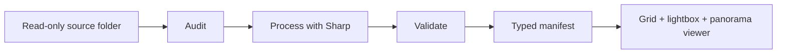

# Photography pipeline

[← Back to the main README](../../README.md)

The photography section is backed by a repeatable asset pipeline, not a folder of manually resized exports. I built it to preserve image quality, keep private source information out of the public manifest, and give the UI predictable responsive assets.



## `01` Audit before processing

The source directory is treated as read-only. The audit records checksums, dimensions, orientation, color information, safe camera fields, and warnings. It also checks for exact duplicates, likely visual duplicates, GPS data, serial-number metadata, unsupported formats, and GPano information for confirmed 360° images.

```text
source file
   ├──► identity     checksum + stable public ID
   ├──► quality      dimensions + orientation + color profile
   ├──► privacy      GPS + serial-number detection
   └──► format       raster + DNG + panorama classification
```

## `02` Processing and cache behavior

[`scripts/photos/pipeline.ts`](../../scripts/photos/pipeline.ts) uses Sharp and a versioned processing profile to create role-specific derivatives without upscaling the source. Cache keys include the source and curation inputs, so changing either invalidates the affected output instead of rebuilding everything blindly.

The pipeline supports separate commands for auditing, processing, validation, and reporting. A combined command runs the complete flow.

```bash
bun run photos:audit -- --source /path/to/photos
bun run photos:process -- --source /path/to/photos
bun run photos:validate -- --source /path/to/photos
bun run photos:report -- --source /path/to/photos
bun run photos:all -- --source /path/to/photos
```

## `03` A typed public boundary

Processing writes [`lib/photography.generated.ts`](../../lib/photography.generated.ts), which contains the public URLs, dimensions, blur placeholders, safe display metadata, and panorama information the UI needs. Private source paths and sensitive metadata are not part of the gallery's public model.

```text
private processing data  ║  typed public manifest  ║  browser UI
                         ║                         ║
source paths · GPS       ║  URLs · dimensions      ║  grid
serials · audit details  ║  blur data · safe EXIF  ║  lightbox
                         ║  panorama metadata      ║  360° viewer
```

## `04` Responsive delivery

The gallery uses Next.js Image with intrinsic aspect ratios so the layout reserves space before an image arrives. It gives the first visible image eager priority, lazy-loads the rest, uses generated blur placeholders, and prefetches adjacent lightbox images after the active frame decodes.

The interaction layer adds:

- Responsive grid derivatives and larger viewer derivatives
- Shared-element transitions between a print and its lightbox view
- Keyboard navigation, focus containment, and focus restoration
- Swipe thresholds that reject mostly vertical gestures
- A dynamically loaded Three.js panorama viewer for confirmed 360° frames

## `05` Why I built the pipeline

The main trade-off is more tooling in exchange for a safer and repeatable publishing flow. The UI no longer needs to guess dimensions or carry private source knowledge, and a new photo can pass through the same audit, processing, validation, and delivery contract as the existing set.

Related source:

- [`scripts/photos/`](../../scripts/photos/) — pipeline, EXIF parsing, profiles, and tests
- [`lib/photography.config.ts`](../../lib/photography.config.ts) — gallery-facing configuration
- [`components/photography/`](../../components/photography/) — gallery and panorama viewer

Back to [Architecture](../architecture/README.md) or [Interaction engineering](../interactions/README.md).
